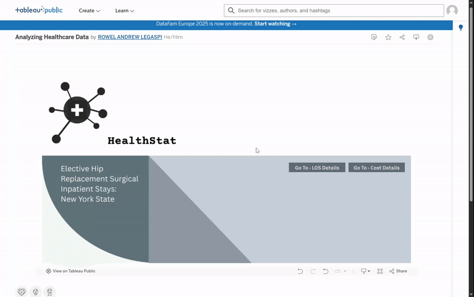
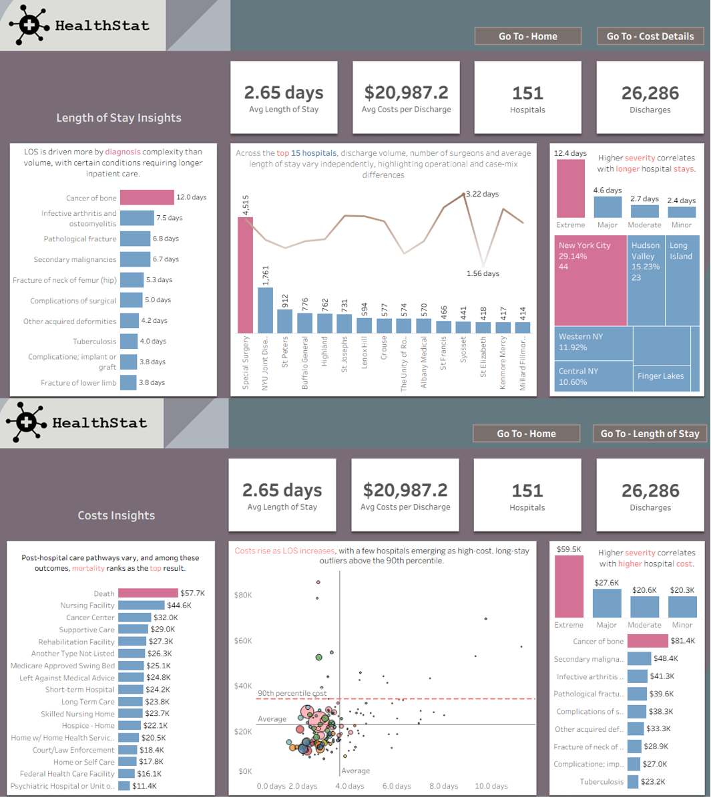

# Project Background
We'll explore a real-world dataset to uncover hospital efficiency insights for a fictional consulting company called HealthStat. We’ll analyze attributes impacting the patient length of stay (LOS) and cost and work to identify factors contributing to hospital differences. In healthcare, improving efficiency while maintaining high-quality patient care is a top priority. 

### Insights and recommendations are provided on the following key areas
- **Length of Stay (LOS Variation):** Analysis of LOS differences across hospitals reveals significant variability that is not explained by patient volume alone, indicating opportunities for operational efficiency improvements. 
- **Cost per Discharge:** Evaluation of hospital-level costs shows that higher costs do not consistently align with longer LOS, suggesting the presence of cost structure and process inefficiencies. 
- **Patient Severity Impact:** Assessment of case severity highlights extreme-severity patients as the primary driver of increased LOS and costs, underscoring the need for severity-adjusted performance metrics.
- **Care Pathway Optimization:** Findings support the refinement of clinical and operational pathways for high-severity cases to reduce unnecessary delays while maintaining quality of care.

Dashboard quick overview

An interactive Tableau Dashboard can be view [here](https://tinyurl.com/3n3yevsx).

### Data Structure & Initial checks
HealthStat database structure came from a csv file, below is a key dataset attributes that needed in this study. With 30 columns and 26594 rows

### Executive Summary

#### Overview of Findings
The analysis of elective hip replacement cases across New York hospitals reveals substantial variation in length of stay (LOS) and cost per discharge, even among facilities with similar patient volumes. Hospital volume alone does not explain these differences, and higher LOS does not consistently translate to higher costs. Instead, patient severity emerges as the primary driver, with extreme-severity cases significantly increasing both LOS and costs. Additionally, staffing factors such as the number of surgeons per patient show minimal impact on efficiency outcomes. These findings highlight opportunities for severity-adjusted benchmarking, targeted intervention on outlier hospitals, and improved care pathway optimization to enhance operational efficiency without compromising quality of care.

### Insights Deep Dive

#### Length of Stay Trends:
- Average length of stay across all hospitals is 2.65 days, with significant variation based on diagnosis complexity. Discharge volumes and severity levels directly impact operational capacity and resource allocation.

- Cancer of bone treatments require the longest stays at 12.0 days, representing extreme severity cases. This is significantly higher than the system average and requires specialized care protocols.

- Top 15 hospitals show independent variation in LOS and discharge volumes, highlighting operational and case-mix differences. Special Surgery leads with 5.73 days average but highest discharge volume of 1,751 patients.

- Higher severity cases (Extreme: 12.4 days) correlate with longer hospital stays, with New York City region accounting for 29.14% of extreme cases across 44 hospitals.

#### Cost Insights:

- Post-hospital care pathways vary significantly in cost, with mortality outcomes ranking as the most expensive at $57.7K average cost. This reflects the intensive care and extended treatment attempts for critically ill patients before death.

- Costs rise as LOS increases, with a few hospitals emerging as high-cost, long-stay outliers above the 90th percentile. The scatter plot reveals a positive correlation between length of stay and total discharge costs across all facilities.

- Extreme severity cases cost $59.5K on average, nearly 3x higher than moderate severity cases at $20.6K. Cancer of bone leads all diagnoses at $81.4K, driven by complex treatment protocols and extended hospital stays.

- The 90th percentile cost threshold serves as a key benchmark, identifying hospitals with significantly higher costs that may require targeted efficiency reviews or reflect specialized case complexity requiring premium resources.

### Recommendations: LOS & Cost Optimization

#### Targeted Care Pathways for High-Cost Diagnoses
+ **Finding:** Cancer of bone cases cost $81.4K with 12-day average LOS—far above the $21K system average.
+ **Recommendation:** Implement specialized multidisciplinary protocols for extreme severity cases (cancer, infective arthritis) with early discharge planning from day 1. Expected savings: $8K-$12K per case.

#### Address 90th Percentile Cost Outliers
+ **Finding:** Several hospitals operate significantly above cost benchmarks with extended LOS and elevated expenses.
+ **Recommendation:** Conduct operational audits of high-cost facilities, benchmark against efficient peers, and share best practices across the network. Target $3K-$5K cost reduction per discharge at outlier hospitals.

#### Reduce Mortality Pathway Costs
+ **Finding:** Death outcomes rank highest at $57.7K, indicating intensive end-of-life care.
+ **Recommendation:** Deploy early warning systems for deteriorating patients, implement palliative care consultations where appropriate, and establish standardized ICU criteria. Reduce preventable critical escalations by 5-8%.

#### Severity-Based Discharge Planning
+ **Finding:** Extreme cases (12.4 days, $59.5K) cost 3x more than moderate cases (2.7 days, $20.6K).
+ **Recommendation:** Launch tiered discharge planning—extreme cases start day 1, moderate cases day 3. Deploy dedicated care coordinators for complex cases. Expected LOS reduction: 1.5-2.0 days for extreme cases.

#### Regional Performance Benchmarking
+ **Finding:** NYC accounts for 29.14% of extreme cases across 44 hospitals with significant regional variation.
+ **Recommendation:** Create regional collaborative networks for data sharing and peer learning. Establish region-specific targets and centralize high-complexity cases in centers of excellence. Reduce regional cost variation by 20-25%.

### Summary Impact:

- **Cost Savings:** $17M-$27M annually (8-13% reduction)
- **LOS Improvement:** 0.25-0.45 days reduction system-wide
- **Quality Gains:** 5-10% reduction in complications and readmissions

## Contact
### Rowel Andrew Legaspi (Drew)  
- LinkedIn: https://www.linkedin.com/in/rowel-andrew-legaspi-289936241/
- Tableau Profile: https://public.tableau.com/app/profile/rowel.andrew.legaspi
